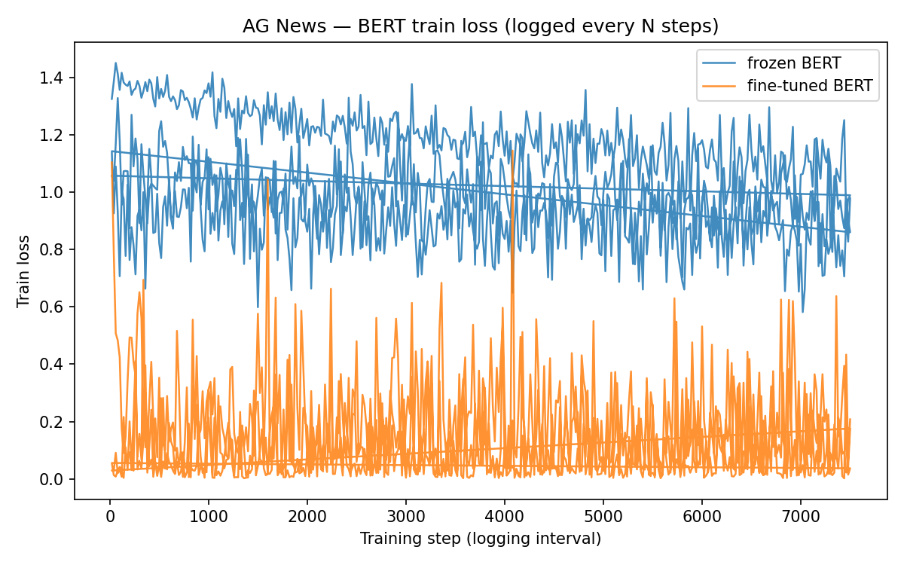

# CS 5365 — BERT re-implementation (frozen vs fine-tuning)

Sabas Rojas, Daniel Duru · UTEP

GitHub repo for our final project: we study **linear probing on frozen BERT** versus **full fine-tuning** on text classification, in the style of Devlin et al. (NAACL 2019). Code lives under `code/`; results we got are under `results/`.

---

## Introduction

This repo holds our **re-implementation / experiment** for the BERT paper (*BERT: Pre-training of Deep Bidirectional Transformers for Language Understanding*, NAACL 2019). The paper’s idea is **masked LM + next-sentence pretraining**, then **fine-tuning** on downstream tasks — that “pretrain then fine-tune” setup became the usual NLP baseline.

We don’t re-run Google’s original TensorFlow training; we use **Hugging Face + PyTorch** and `bert-base-uncased` weights, which is the normal shortcut for a course project.

---

## Chosen result

We tried to reproduce the **same kind of comparison** the paper motivates: using BERT as **fixed features + classifier** vs **updating all (or most) BERT weights** on a classification task. In the paper, the big headline numbers are on **GLUE** — see **Table 1** (GLUE test scores for BERT vs baselines). We’re not matching those GLUE digits; we run the **same experimental idea** on **AG News** (one of the tasks suggested in the project handout: SST-2, MRPC, or AG News).

Why it matters: it answers whether you can get away with only training a small head (cheap) or if you need full fine-tuning (slower, more GPU memory).

---

## Repository contents

| Path | What’s in it |
|------|----------------|
| `code/` | Training script, model helpers, optional loss plot |
| `data/` | Note only — dataset isn’t stored in the repo (see below) |
| `results/` | CSV metrics, loss logs, `loss_curves.png` if you plot |
| `report/` | Drop **final report PDF** here for submission |
| `poster/` | Drop **poster PDF** here for class |
| `LICENSE` | MIT |
| `.gitignore` | Python junk, venv, etc. |

---

## Re-implementation details

- **Model:** `bert-base-uncased`, classification head from Hugging Face `AutoModelForSequenceClassification`.
- **Frozen run:** all parameters whose names start with `bert.` have `requires_grad=False`; only the head trains (linear probe on top of `[CLS]`-style pooled output).
- **Fine-tune run:** full model trains.
- **Data:** AG News (4-class). Train split for optimization; **test** split for accuracy / weighted F1.
- **Optimizer:** AdamW, default lr `2e-5`, batch 16, max length 128 (see `code/train.py` for flags).
- **Metrics:** accuracy and sklearn **weighted F1** on test after each epoch; last epoch is what we save to `comparison_summary.csv`.

**What we changed vs the original paper:** we don’t implement MLM/NSP pretraining — we load pretrained weights. We use AG News instead of GLUE tasks in Table 1. Stack is PyTorch/HF, not the official `google-research/bert` repo.

**What was annoying:** long runs on CPU; making sure batches use `labels` (HF) instead of the dataset column name `label`.

---

## Reproduction steps

**Install (venv recommended on Mac):**

```bash
python3 -m venv .venv
source .venv/bin/activate
pip install -r code/requirements.txt
```

**Train both modes and write CSVs:**

```bash
python3 -m code.train --dataset ag_news --mode both --epochs 3 --batch_size 16
```

Useful flags: `--learning_rate`, `--max_length`, `--seed`, `--log_every_steps`, `--mode frozen` or `finetune` alone.

**Optional plot** (needs matplotlib):

```bash
python3 -m code.plot_losses
```

**Hardware:** CPU works; fine-tuning is **much** faster on a GPU. 8–16 GB RAM is usually enough for this setup.

---

## Results / insights

**Our last run** (see `results/comparison_summary.csv`):

| Mode | Test accuracy | Weighted F1 |
|------|----------------|-------------|
| Frozen | 0.7404 | 0.7387 |
| Fine-tune | 0.9463 | 0.9464 |

So fine-tuning wins by ~20 points accuracy on our settings — same **direction** as in the paper’s story (task-specific fine-tuning strongly beats shallow use of frozen representations on hard tasks), even though our absolute numbers are on AG News, not GLUE Table 1.

Loss curves (logged every 20 steps during training):



If you clone fresh and run again, expect slightly different decimals (seed, hardware, library versions). You should still see fine-tune above frozen.

---

## Conclusion

Frozen BERT is lighter but plateaus; full fine-tuning fits AG News much better for us. Lesson: if you can afford the GPU time, fine-tuning is worth it on this task. We’d need more runs (other seeds, SST-2) to claim anything broader.

---

## References

1. Devlin, J., Chang, M.-W., Lee, K., & Toutanova, K. (2019). *BERT: Pre-training of Deep Bidirectional Transformers for Language Understanding.* Proceedings of NAACL-HLT 2019. (Also referenced as arXiv:1810.04805.)
2. Hugging Face `transformers`: https://huggingface.co/docs/transformers  
3. Hugging Face `datasets`: https://huggingface.co/docs/datasets  

Original Google repo (TensorFlow): https://github.com/google-research/bert  

---

## Acknowledgements

Project for **CS 5365** (Deep Learning), UTEP.
